# SAP CPI – Processando JSON com Groovy Script e Gerando Resumo de Transações

🔀 SAP BTP CPI - Groovy Script Alterando Payload


🔎 Contexto do Cenário

Este repositório demonstra nas integrações no SAP Cloud Integration (CPI), é muito comum receber mensagens em JSON contendo listas de registros, como transações de vendas, compras ou eventos.

Neste exemplo, o iFlow recebe um JSON de compras, contendo:

* Informações gerais da loja

* Uma lista de transações

* Diferentes tipos de pagamento

* Valores monetários

📌  O objetivo é processar essas informações via Groovy Script e gerar um JSON de saída resumido, com dados consolidados.


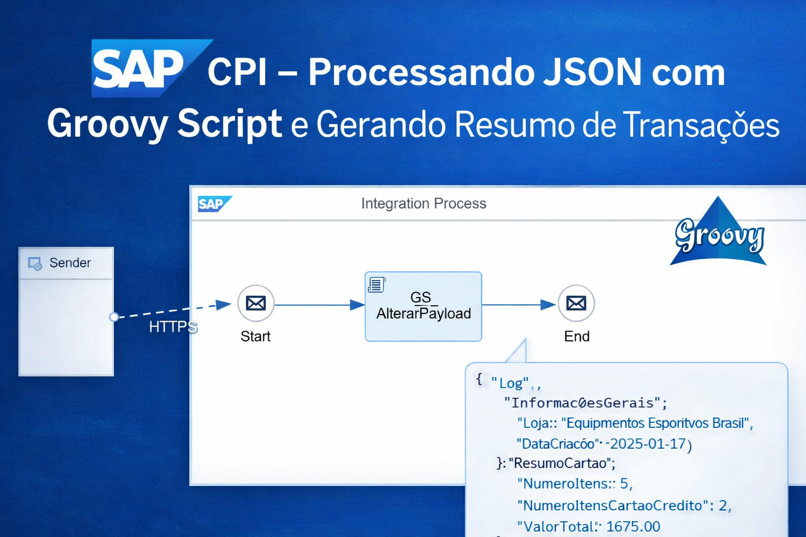


## 🔄 Fluxo do iFlow

### Adicionando Pacote
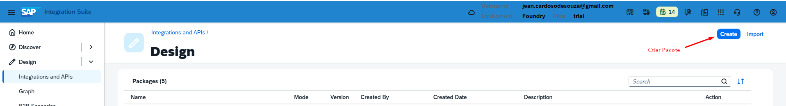

### Criando o Pacote
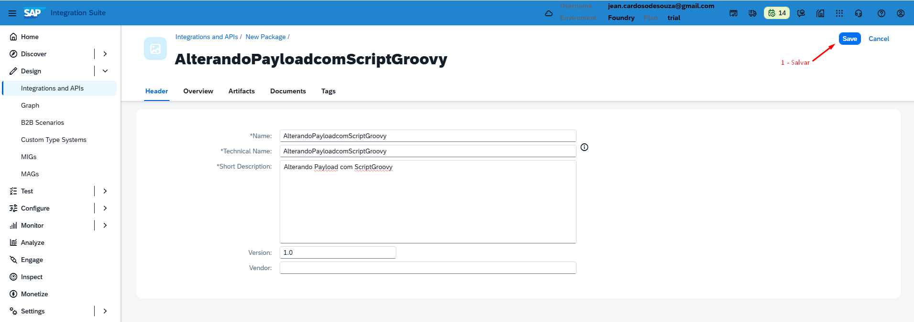

### Criando o Integration iFlow
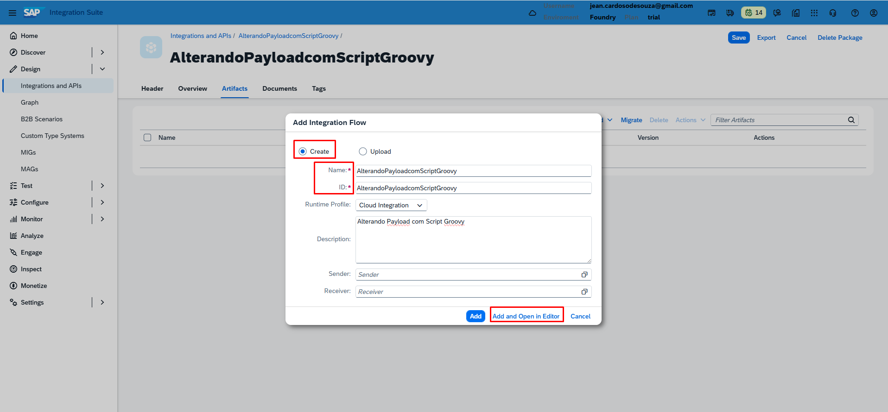

### Editando o Integration iFlowe
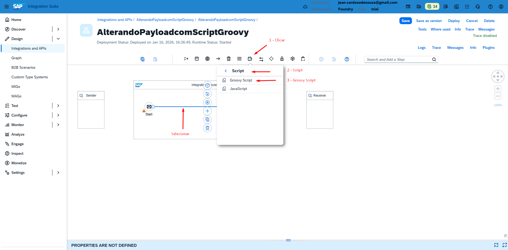

### Adicionando o Groovy Script
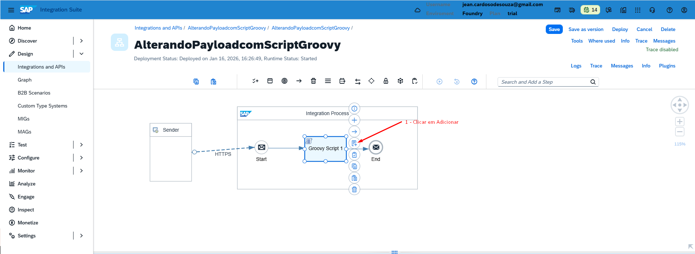

### Editando o Groovy Script
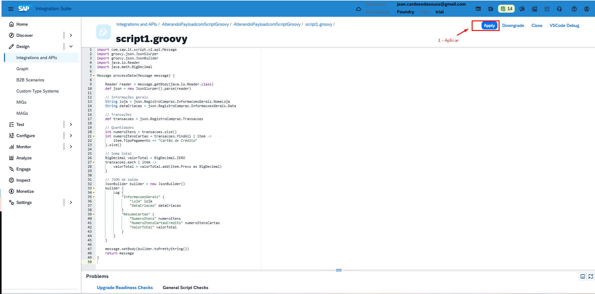

📄 [`GroovyScript/AlterarPayload.groovy`](GroovyScript/AlterarPayload.groovy)

``` Groovy Script
import com.sap.it.script.v2.api.Message
import groovy.json.JsonSlurper
import groovy.json.JsonBuilder
import java.io.Reader
import java.math.BigDecimal

Message processData(Message message) {

    Reader reader = message.getBody(java.io.Reader.class)
    def json = new JsonSlurper().parse(reader)

    // Informações gerais
    String loja = json.RegistroCompras.InformacoesGerais.NomeLoja
    String dataCriacao = json.RegistroCompras.InformacoesGerais.Data

    // Transações
    def transacoes = json.RegistroCompras.Transacoes

    // Quantidades
    int numeroItens = transacoes.size()
    int numeroItensCartao = transacoes.findAll { item ->
        item.TipoPagamento == "Cartão de Crédito"
    }.size()

    // Soma total
    BigDecimal valorTotal = BigDecimal.ZERO
    transacoes.each { item ->
        valorTotal = valorTotal.add(item.Preco as BigDecimal)
    }

    // JSON de saída
    JsonBuilder builder = new JsonBuilder()
    builder {
        Log {
            "InformacoesGerais" {
                "Loja" loja
                "DataCriacao" dataCriacao
            }
            "ResumoCartao" {
                "NumeroItens" numeroItens
                "NumeroItensCartaoCredito" numeroItensCartao
                "ValorTotal" valorTotal
            }
        }
    }

    message.setBody(builder.toPrettyString())
    return message
}

```

### Editando o nome do Groovy Script para **GP_AlterarPayload**
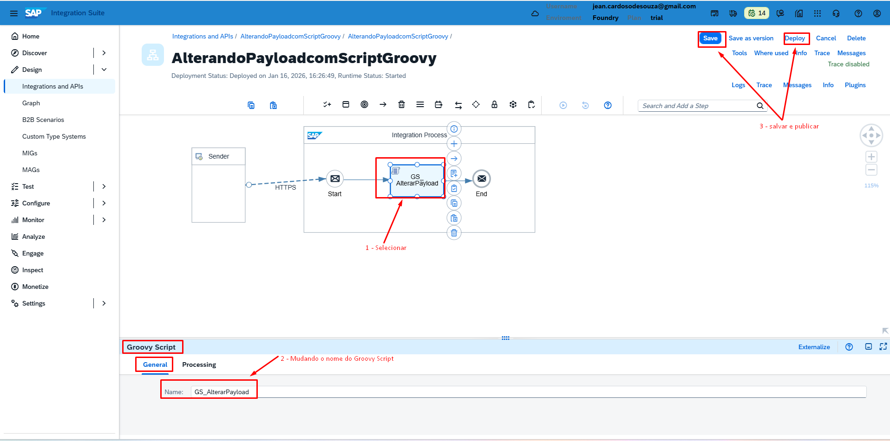


## 📥 Exemplo de Payload JSON

### O JSON utilizado no teste pode ser encontrado em:
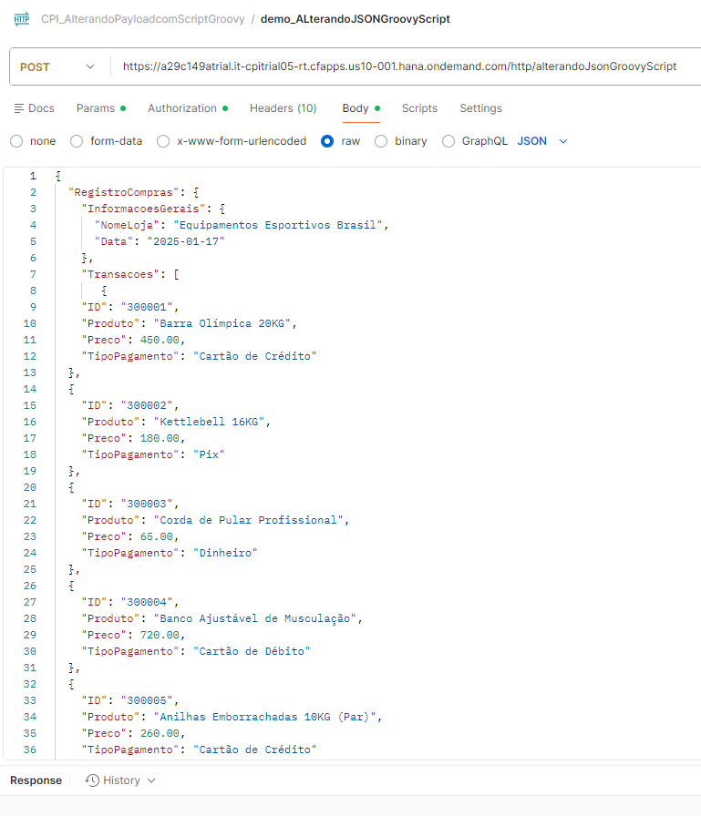
---

📄 [`Json/RegistroCompras.json`](Json/RegistroCompras.json)

```json
{
  "RegistroCompras": {
    "InformacoesGerais": {
      "NomeLoja": "Equipamentos Esportivos Brasil",
      "Data": "2025-01-17"
    },
    "Transacoes": [
       {
    "ID": "300001",
    "Produto": "Barra Olímpica 20KG",
    "Preco": 450.00,
    "TipoPagamento": "Cartão de Crédito"
  },
  {
    "ID": "300002",
    "Produto": "Kettlebell 16KG",
    "Preco": 180.00,
    "TipoPagamento": "Pix"
  },
  {
    "ID": "300003",
    "Produto": "Corda de Pular Profissional",
    "Preco": 65.00,
    "TipoPagamento": "Dinheiro"
  },
  {
    "ID": "300004",
    "Produto": "Banco Ajustável de Musculação",
    "Preco": 720.00,
    "TipoPagamento": "Cartão de Débito"
  },
  {
    "ID": "300005",
    "Produto": "Anilhas Emborrachadas 10KG (Par)",
    "Preco": 260.00,
    "TipoPagamento": "Cartão de Crédito"
  }
    ]
  }
}
```

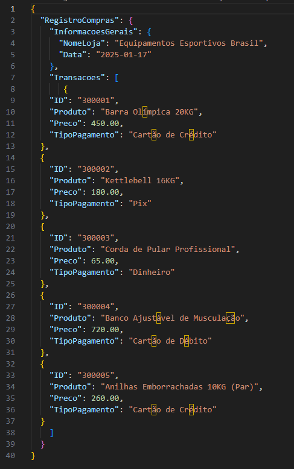

## 🔄 Fluxo do Postman
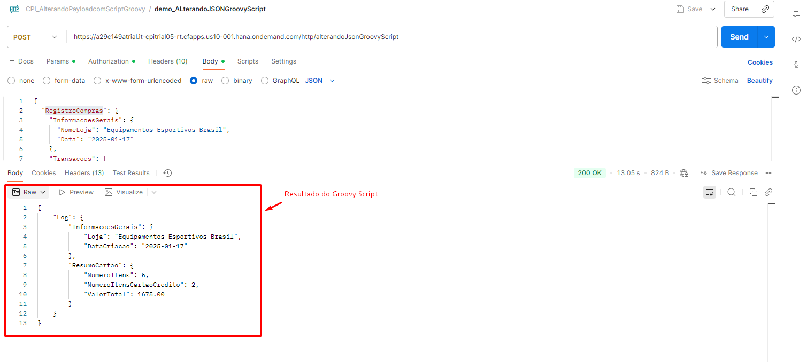


## 🔄 json saida postman
```json saida postman
{
    "Log": {
        "InformacoesGerais": {
            "Loja": "Equipamentos Esportivos Brasil",
            "DataCriacao": "2025-01-17"
        },
        "ResumoCartao": {
            "NumeroItens": 5,
            "NumeroItensCartaoCredito": 2,
            "ValorTotal": 1675.00
        }
    }
}
```


## 📦 Exemplo prático – iFlow para baixar

📦 [Download do iFlow – Package/AlterandoPayloadcomScriptGroovy.zip](Package/Package/OData%20Integration%20with%20FTP.zip)


> O arquivo pode ser importado diretamente no SAP Integration Suite (CPI).
